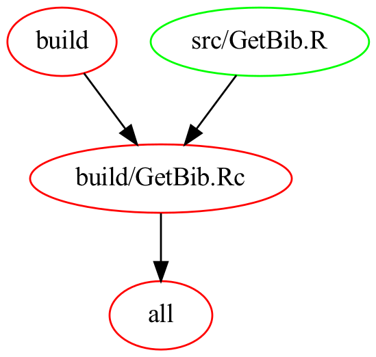

# cli-scripts

Command line scripts I frequently use in my work

## To use

After cloning this repo, you will need to add the `bin` directory to your PATH. You will also need to add an environmental variable, `CLISCRIPTSLOC`, which points to the location of this repository E.G. by adding this line to your `.zshrc` or `.bashrc` file

```bash
export CLISCRIPTSLOC="/Users/s1961592/cli-scripts"
```

Finally, this repository uses GNU Make to compile code. Run `make` to compile R code to bytecode. 

